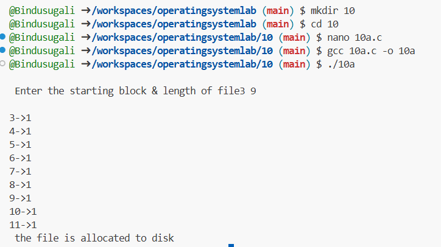

### Simulate the following file allocation strategies a) Sequential b) Indexed c) Linked
```c
#include <stdio.h>
#include <stdlib.h>

int main()
{
    int f[50], i, st, j, len, c, k;

    // Initialize all blocks to 0 (unallocated)
    for (i = 0; i < 50; i++)
        f[i] = 0;
   
    // Loop to allocate files to disk
    X:
    printf("\nEnter the starting block & length of file: ");
    scanf("%d%d", &st, &len);
   
    // Try to allocate the blocks
    for (j = st; j < (st + len); j++) {
        if (f[j] == 0) {
            f[j] = 1;
            printf("\n%d -> %d", j, f[j]);
        } else {
            printf("Block already allocated\n");
            break;
        }
    }
   
    // If we allocated all blocks successfully
    if (j == (st + len))
        printf("\nThe file is allocated to disk");
   
    // Ask if the user wants to enter more files
    printf("\nIf you want to enter more files? (y-1/n-0): ");
    scanf("%d", &c);
   
    if (c == 1)
        goto X;
    else
        exit(0); // Exit program

    return 0; // Return an integer from main
}
```

Indexed
```c
#include <stdio.h>
#include <stdlib.h>

int f[50], i, k, j, inde[50], n, c, count = 0, p;

int main()
{
    // Initialize all blocks to 0 (unallocated)
    for (i = 0; i < 50; i++)
        f[i] = 0;
   
    // Loop to allocate files to blocks
    x:
    printf("Enter index block: ");
    scanf("%d", &p);

    // Check if the block is already allocated
    if (f[p] == 0) {
        f[p] = 1;
        printf("Enter number of files on index: ");
        scanf("%d", &n);
    } else {
        printf("Block already allocated\n");
        goto x;
    }

    // Get the indices of the files
    for (i = 0; i < n; i++)
        scanf("%d", &inde[i]);

    // Check if the blocks for the files are already allocated
    for (i = 0; i < n; i++) {
        if (f[inde[i]] == 1) {
            printf("Block already allocated\n");
            goto x;
        }
    }

    // Allocate the files to the blocks
    for (j = 0; j < n; j++)
        f[inde[j]] = 1;

    // Print the allocation details
    printf("\nAllocated\n");
    printf("File indexed:\n");
    for (k = 0; k < n; k++)
        printf("\n%d -> %d : %d", p, inde[k], f[inde[k]]);
   
    // Ask if the user wants to enter more files
    printf("\nEnter 1 to enter more files and 0 to exit: ");
    scanf("%d", &c);
   
    if (c == 1)
        goto x;
    else
        exit(0); // Exit the program
   
    return 0; // Return an integer from main
}
```

 Linked
 ```c
#include <stdio.h>
#include <stdlib.h>

int main() {
    int f[50] = {0}; // Array to track allocated blocks
    int p, i, j, k, a, st, len, n, c;

    printf("Enter how many blocks are already allocated: ");
    scanf("%d", &p);

    printf("Enter the block numbers that are already allocated: ");
    for (i = 0; i < p; i++) {
        scanf("%d", &a);
        if (a >= 0 && a < 50) {
            f[a] = 1;
        } else {
            printf("Invalid block number! Must be between 0 and 49.\n");
            i--; // Re-enter this input
        }
    }

    while (1) {
        printf("Enter the starting index block and length: ");
        scanf("%d%d", &st, &len);

        if (st < 0 || st >= 50 || len <= 0) {
            printf("Invalid input! Start block should be 0-49 and length should be positive.\n");
            continue;
        }

        k = len;
        for (j = st; j < (st + k) && j < 50; j++) {
            if (f[j] == 0) {
                f[j] = 1;
                printf("\n%d -> Allocated", j);
            } else {
                printf("\n%d -> Block is already allocated!", j);
                k++; // Extend length if block is occupied
                if (st + k >= 50) break; // Prevent overflow
            }
        }

        printf("\nDo you want to enter another file? (Yes-1/No-0): ");
        scanf("%d", &c);
        if (c == 0) {
            break;
        }
    }

    return 0;
}
```

