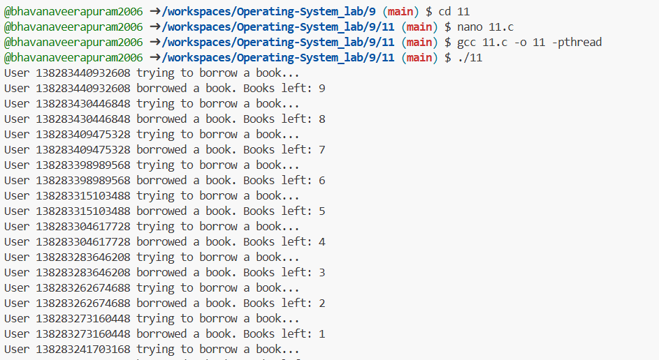

###  A library management system requires that only one user can borrow or return a book at a time to maintain database consistency
```c
#include <stdio.h>
#include <pthread.h>
#include <unistd.h>

pthread_mutex_t lock; // Mutex for synchronization
int books_available = 10; // Example: Total books in the library

void *borrow_book(void *arg) {
    pthread_mutex_lock(&lock); // Lock the critical section
    printf("User %ld trying to borrow a book...\n", pthread_self());
    
    if (books_available > 0) {
        books_available--;
        printf("User %ld borrowed a book. Books left: %d\n", pthread_self(), books_available);
    } else {
        printf("User %ld: No books available to borrow!\n", pthread_self());
    }

    pthread_mutex_unlock(&lock); // Unlock the critical section
    return NULL;
}

void *return_book(void *arg) {
    pthread_mutex_lock(&lock); // Lock the critical section
    printf("User %ld trying to return a book...\n", pthread_self());

    books_available++;
    printf("User %ld returned a book. Books now: %d\n", pthread_self(), books_available);

    pthread_mutex_unlock(&lock); // Unlock the critical section
    return NULL;
}

int main() {
    pthread_t users[30];

    if (pthread_mutex_init(&lock, NULL) != 0) {
        printf("Mutex initialization failed!\n");
        return 1;
    }

    // Creating threads for borrowing and returning books
    for (int i = 0; i < 15; i++) {
        if (pthread_create(&users[i], NULL, borrow_book, NULL) != 0) {
            printf("Error creating borrow thread %d\n", i);
        }
    }
    for (int i = 15; i < 30; i++) {
        if (pthread_create(&users[i], NULL, return_book, NULL) != 0) {
            printf("Error creating return thread %d\n", i);
        }
    }

    // Wait for all threads to finish
    for (int i = 0; i < 6; i++) {
        pthread_join(users[i], NULL);
    }

    pthread_mutex_destroy(&lock); // Destroy mutex
    return 0;
}
```

