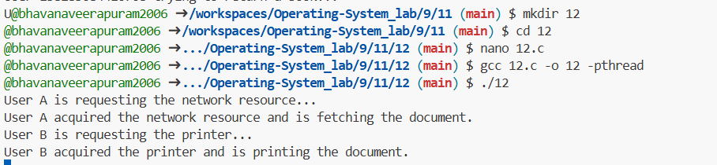

### A printing service in an office environment where multiple users send print jobs to multiple printers. Each print job requires exclusive access to both a printer and a network resource to fetch the document to be printer. Simulate a scenario where deadlocks can occur
```c
#include <stdio.h>
#include <pthread.h>
#include <unistd.h>

// Mutex locks for network resource and printer
pthread_mutex_t network_lock;
pthread_mutex_t printer_lock;

// Function for User A's print job
void* print_job_A(void* arg) {
    printf("User A is requesting the network resource...\n");
    pthread_mutex_lock(&network_lock);
    printf("User A acquired the network resource and is fetching the document.\n");
    sleep(100); // Simulating document fetching

    printf("User A is requesting the printer...\n");
    pthread_mutex_lock(&printer_lock); // Deadlock occurs here
    printf("User A acquired the printer and is printing the document.\n");
    sleep(200);

    printf("User A finished printing and is releasing resources.\n");
    pthread_mutex_unlock(&printer_lock);
    pthread_mutex_unlock(&network_lock);

    return NULL;
}

// Function for User B's print job
void* print_job_B(void* arg) {
    printf("User B is requesting the printer...\n");
    pthread_mutex_lock(&printer_lock);
    printf("User B acquired the printer and is printing the document.\n");
    sleep(100); // Simulating printing delay

    printf("User B is requesting the network resource...\n");
    pthread_mutex_lock(&network_lock); // Deadlock occurs here
    printf("User B acquired the network resource and is fetching the document.\n");
    sleep(200);

    printf("User B finished printing and is releasing resources.\n");
    pthread_mutex_unlock(&network_lock);
    pthread_mutex_unlock(&printer_lock);

    return NULL;
}

int main() {
    pthread_t user1, user2;

    // Initialize mutex locks
    pthread_mutex_init(&network_lock, NULL);
    pthread_mutex_init(&printer_lock, NULL);

    // Creating two threads for User A and User B
    pthread_create(&user1, NULL, print_job_A, NULL);
    sleep(1); // Force interleaving
    pthread_create(&user2, NULL, print_job_B, NULL);

    // Waiting for both threads to finish (which they never will due to deadlock)
    pthread_join(user1, NULL);
    pthread_join(user2, NULL);

    // Destroy mutex locks (unreachable due to deadlock)
    pthread_mutex_destroy(&network_lock);
    pthread_mutex_destroy(&printer_lock);

    return 0;
}
```

