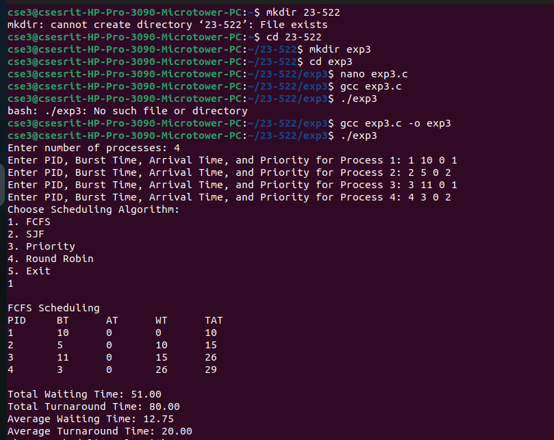
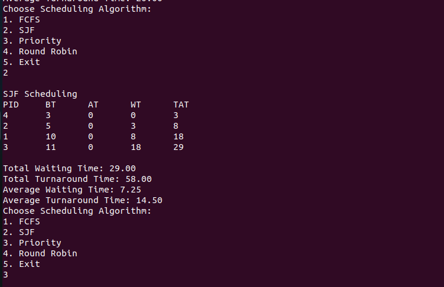
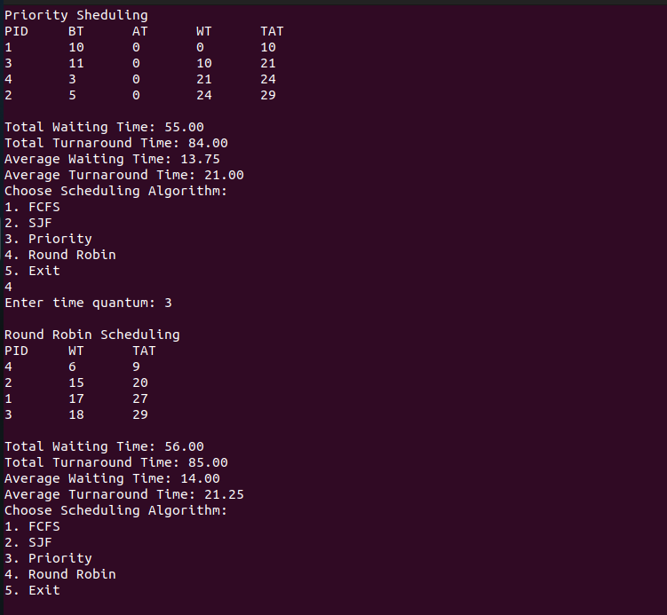
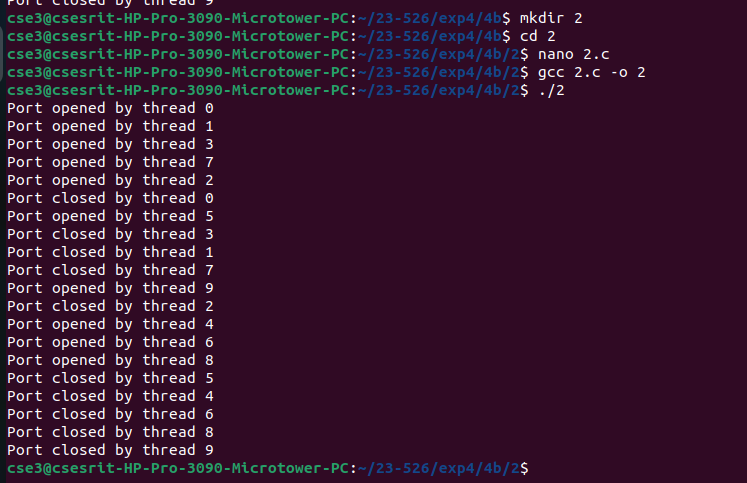
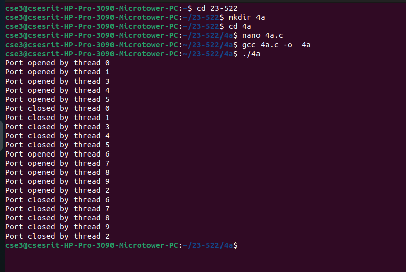

> ## To stimulate CPU Scheduling Algorithms like FCFS, SJF, RR and Priority using C
``` c
#include <stdio.h>

struct Process {
    int pid;
    int burst_time;
    int arrival_time;
    int priority;
};

void calculate_avg_times(int wait_time[], int turnaround_time[], int n) {
    float total_wt = 0, total_tat = 0;
    for (int i = 0; i < n; i++) {
        total_wt += wait_time[i];
        total_tat += turnaround_time[i];
    }
    printf("\nTotal Waiting Time: %.2f", total_wt);
    printf("\nTotal Turnaround Time: %.2f", total_tat);
    printf("\nAverage Waiting Time: %.2f", total_wt / n);
    printf("\nAverage Turnaround Time: %.2f\n", total_tat / n);
}

void fcfs(struct Process p[], int n) {
    int wait_time[n], turnaround_time[n], completion_time[n];
   
    completion_time[0] = p[0].arrival_time + p[0].burst_time;
    wait_time[0] = 0;
    turnaround_time[0] = completion_time[0] - p[0].arrival_time;
   
    for (int i = 1; i < n; i++) {
        completion_time[i] = completion_time[i - 1] + p[i].burst_time;
        wait_time[i] = completion_time[i - 1] - p[i].arrival_time;
        turnaround_time[i] = wait_time[i] + p[i].burst_time;
    }
   
   
    printf("PID\tBT\tAT\tWT\tTAT\n");
    for (int i = 0; i < n; i++) {
        printf("%d\t%d\t%d\t%d\t%d\n", p[i].pid, p[i].burst_time, p[i].arrival_time, wait_time[i], turnaround_time[i]);
    }
    calculate_avg_times(wait_time, turnaround_time, n);
}

void sjf(struct Process p[], int n) {
    struct Process temp;
    int wait_time[n], turnaround_time[n], completion_time[n];
   
    for (int i = 0; i < n - 1; i++) {
        for (int j = i + 1; j < n; j++) {
            if (p[i].burst_time > p[j].burst_time) {
                temp = p[i];
                p[i] = p[j];
                p[j] = temp;
            }
        }
    }
   
    completion_time[0] = p[0].arrival_time + p[0].burst_time;
    wait_time[0] = 0;
    turnaround_time[0] = completion_time[0] - p[0].arrival_time;
   
    for (int i = 1; i < n; i++) {
        completion_time[i] = completion_time[i - 1] + p[i].burst_time;
        wait_time[i] = completion_time[i - 1] - p[i].arrival_time;
        turnaround_time[i] = wait_time[i] + p[i].burst_time;
    }
   
    printf("\nSJF Scheduling\n");
    printf("PID\tBT\tAT\tWT\tTAT\n");
    for (int i = 0; i < n; i++) {
        printf("%d\t%d\t%d\t%d\t%d\n", p[i].pid, p[i].burst_time, p[i].arrival_time, wait_time[i], turnaround_time[i]);
    }
    calculate_avg_times(wait_time, turnaround_time, n);
}

void priority_scheduling(struct Process p[], int n) {
    struct Process temp;
    for (int i = 0; i < n - 1; i++) {
        for (int j = i + 1; j < n; j++) {
            if (p[i].priority > p[j].priority) {
                temp = p[i];
                p[i] = p[j];
                p[j] = temp;
            }
        }
    }
    fcfs(p, n);
}

void round_robin(struct Process p[], int n, int quantum) {
    int remaining_bt[n], wait_time[n], turnaround_time[n], completion_time[n];
    for (int i = 0; i < n; i++) remaining_bt[i] = p[i].burst_time;
    int time = 0, done;
   
    printf("\nRound Robin Scheduling\n");
    printf("PID\tWT\tTAT\n");
   
    do {
        done = 1;
        for (int i = 0; i < n; i++) {
            if (remaining_bt[i] > 0) {
                done = 0;
                if (remaining_bt[i] > quantum) {
                    time += quantum;
                    remaining_bt[i] -= quantum;
                } else {
                    time += remaining_bt[i];
                    wait_time[i] = time - p[i].arrival_time - p[i].burst_time;
                    turnaround_time[i] = time - p[i].arrival_time;
                    printf("%d\t%d\t%d\n", p[i].pid, wait_time[i], turnaround_time[i]);
                    remaining_bt[i] = 0;
                }
            }
        }
    } while (!done);
    calculate_avg_times(wait_time, turnaround_time, n);
}

int main() {
    int n;
    printf("Enter number of processes: ");
    scanf("%d", &n);
    struct Process p[n];
   
    for (int i = 0; i < n; i++) {
        printf("Enter PID, Burst Time, Arrival Time, and Priority for Process %d: ", i + 1);
        scanf("%d %d %d %d", &p[i].pid, &p[i].burst_time, &p[i].arrival_time, &p[i].priority);
    }
   
    int choice, quantum;
    do {
        printf("Choose Scheduling Algorithm:\n1. FCFS\n2. SJF\n3. Priority\n4. Round Robin\n5. Exit\n");
        scanf("%d", &choice);
       
        switch (choice) {
            case 1:
printf("\nFCFS Scheduling\n");
                fcfs(p, n);
                break;
            case 2:
                sjf(p, n);
                break;
            case 3:
printf("\nPriority Sheduling \n");
                priority_scheduling(p, n);
                break;
            case 4:
                printf("Enter time quantum: ");
                scanf("%d", &quantum);
                round_robin(p, n, quantum);
                break;
            case 5:
                printf("Exiting program...\n");
                break;
            default:
                printf("Invalid choice\n");
        }
    } while (choice != 5);
   
    return 0;
}
```
###exp3 command output





> ## Control the number of ports opened systems with a) Semephore
``` c
#include <stdio.h>
#include <unistd.h>
#include <pthread.h>
#include <semaphore.h>

#define MAX_PORTS 5  // Maximum number of ports allowed
sem_t port_semaphore; // Semaphore to control port access

void* open_port(void* arg) {
    sem_wait(&port_semaphore); // Wait if no port is available
    printf("Port opened by thread %ld\n", (long)arg);
   
    // Simulate port usage
    sleep(2);
   
    printf("Port closed by thread %ld\n", (long)arg);
    sem_post(&port_semaphore); // Release the port
    return NULL;
}

int main() {
    pthread_t threads[10];
    sem_init(&port_semaphore, 0, MAX_PORTS); // Initialize semaphore with MAX_PORTS

    for (long i = 0; i < 10; i++) {
        pthread_create(&threads[i], NULL, open_port, (void*)i);
    }

    for (int i = 0; i < 10; i++) {
        pthread_join(threads[i], NULL);
    }

    sem_destroy(&port_semaphore);
    return 0;
}
```
###exp4 command output
.png)
> ## Source Code for Monitors
```
#include <stdio.h>
#include <pthread.h>
#include <unistd.h>  // For sleep()

#define MAX_OPEN_PORTS 5  // Define the maximum number of allowed open ports

// Monitor structure to manage ports
typedef struct {
    int available_ports;
    pthread_mutex_t mutex;
    pthread_cond_t condition;
} PortMonitor;

// Function to initialize the monitor
void init_monitor(PortMonitor* monitor) {
    monitor->available_ports = MAX_OPEN_PORTS;
    pthread_mutex_init(&monitor->mutex, NULL);
    pthread_cond_init(&monitor->condition, NULL);
}

// Function to open a port (monitor-like behavior)
void open_port(PortMonitor* monitor, int thread_id) {
    pthread_mutex_lock(&monitor->mutex);  // Enter critical section

    while (monitor->available_ports == 0) {
        pthread_cond_wait(&monitor->condition, &monitor->mutex);  // Wait if no ports are available
    }
    monitor->available_ports--;  // Allocate a port
    printf("Port opened by thread %d\n", thread_id);

    pthread_mutex_unlock(&monitor->mutex);  // Exit critical section
}

// Function to close a port (monitor-like behavior)
void close_port(PortMonitor* monitor, int thread_id) {
    pthread_mutex_lock(&monitor->mutex);  // Enter critical section

    monitor->available_ports++;  // Release the port
    printf("Port closed by thread %d\n", thread_id);
    pthread_cond_signal(&monitor->condition);  // Notify waiting threads

    pthread_mutex_unlock(&monitor->mutex);  // Exit critical section
}

// Thread function
void* port_handler(void* arg) {
    int thread_id = *(int*)arg;
    static PortMonitor monitor = {0};  // Shared monitor instance

    // Initialize monitor only once (for the first thread)
    if (monitor.available_ports == 0) {
        init_monitor(&monitor);
    }

    open_port(&monitor, thread_id);
    sleep(2);  // Simulate port usage
    close_port(&monitor, thread_id);

    return NULL;
}

int main() {
    pthread_t threads[10];
    int thread_ids[10];

    for (int i = 0; i < 10; i++) {
        thread_ids[i] = i;
        pthread_create(&threads[i], NULL, port_handler, &thread_ids[i]);
    }

    for (int i = 0; i < 10; i++) {
        pthread_join(threads[i], NULL);
    }

    return 0;
}
```
###exp4 command output




