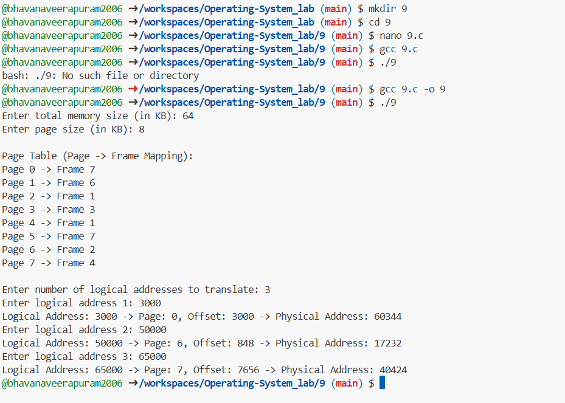

### Simulate Paging Technique of memory management
```c
#include <stdio.h>
#include <stdlib.h>

int *page_table; // Dynamic array for page table
int total_pages, total_frames, page_size, memory_size;

// Function to initialize the page table
void initialize_page_table() {
    printf("\nPage Table (Page -> Frame Mapping):\n");
    for (int i = 0; i < total_pages; i++) {
        page_table[i] = rand() % total_frames; // Random frame allocation
        printf("Page %d -> Frame %d\n", i, page_table[i]);
    }
    printf("\n");
}

// Function to translate logical address to physical address
void translate_address(int logical_address) {
    int page_number = logical_address / page_size;  // Extract page number
    int offset = logical_address % page_size;       // Extract offset

    if (page_number >= total_pages) {
        printf("Invalid Logical Address: %d (Page %d out of bounds)\n", logical_address, page_number);
        return;
    }

    int frame_number = page_table[page_number];  // Get frame from page table
    int physical_address = (frame_number * page_size) + offset;

    printf("Logical Address: %d -> Page: %d, Offset: %d -> Physical Address: %d\n",
           logical_address, page_number, offset, physical_address);
}

int main() {
    // User input for memory size and page size
    printf("Enter total memory size (in KB): ");
    scanf("%d", &memory_size);
    printf("Enter page size (in KB): ");
    scanf("%d", &page_size);

    memory_size *= 1024; // Convert to bytes
    page_size *= 1024;   // Convert to bytes

    total_pages = memory_size / page_size;
    total_frames = total_pages; // Assuming 1:1 frame availability

    // Allocate memory for page table
    page_table = (int *)malloc(total_pages * sizeof(int));

    // Initialize page table with random frame mapping
    initialize_page_table();

    int num_addresses;
    printf("Enter number of logical addresses to translate: ");
    scanf("%d", &num_addresses);

    for (int i = 0; i < num_addresses; i++) {
        int logical_address;
        printf("Enter logical address %d: ", i + 1);
        scanf("%d", &logical_address);
        translate_address(logical_address);
    }

    free(page_table); // Free allocated memory
    return 0;
}
```

